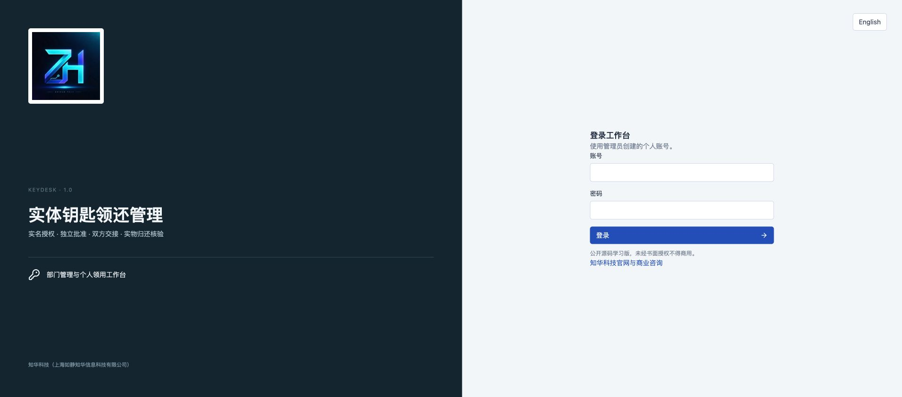
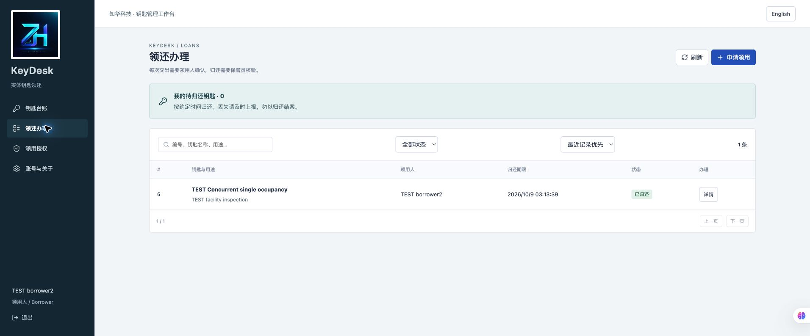
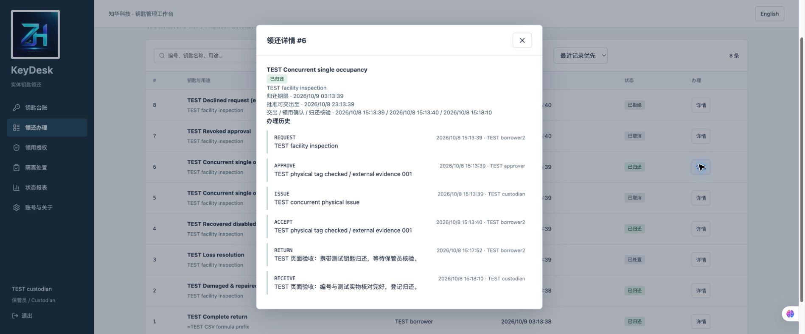
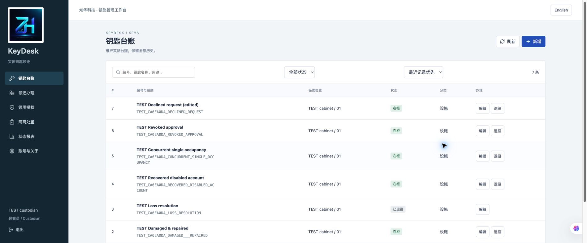
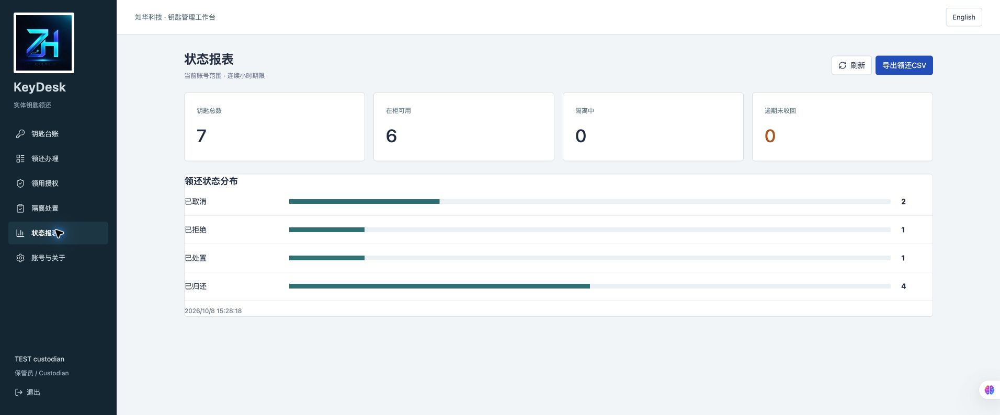
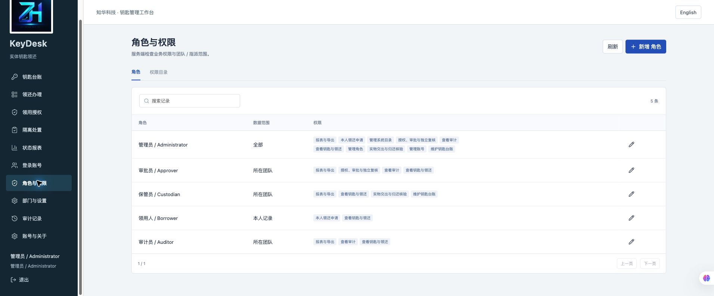
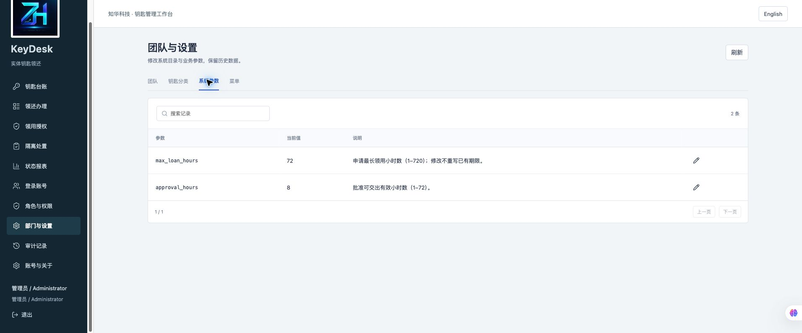
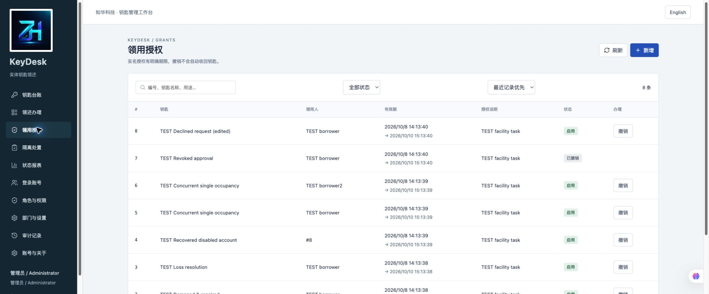

[中文](README.md) | [English](README.en.md)


# KeyDesk · 知华实体钥匙领还管理

**公开源码学习版 1.0.0 · Java 21 / Spring Boot / Vue 3 / MySQL 8.4**

知华科技（上海如静知华信息科技有限公司）。官网：[https://www.zhuatech.cn/](https://www.zhuatech.cn/)。

面向园区、物业、办公室和设施团队的实体钥匙交接台账。围绕“谁被允许领用、谁批准、谁交出、谁实际归还核验”记录业务，帮助研究实名授权、职责分离与数据库事务。适用于单实例、小规模部门台账。

## 一把钥匙的完整流程

```text
钥匙建档 → 审批员签发限时实名授权
                      ↓
领用人申请 → 另一账号批准 → 保管员交出 → 领用人确认
                      ↓
领用人申请归还 → 保管员核对编号与实物 → 完好入柜 / 损坏隔离
                                                   ↓
                                  保管员检查申请 → 另一审批账号放行

无法由本人确认 → 保管员代收实物 → 隔离 → 另一审批账号核验
丢失上报 → 隔离并保留占用 → 独立处置说明 → 该钥匙退役
```

这是一套**人工实物交接记录系统**。点击“已交出”立即占用钥匙，不能把“待领用确认”当作仍在柜；点击“申请归还”不会释放占用。软件不识别实物、不自动开柜、开门或换锁。交出、代收与归还的真实性由工作人员现场核验。

### 已实现能力

| 模块 | 可操作功能与约束 |
|---|---|
| 钥匙台账 | 单件稳定编号、名称、部门、分类、保管位置与备注；描述编辑、退役；占用期间禁止编辑，退役保留历史 |
| 实名授权 | 审批员为另一账号签发有效期，拒绝重叠授权；撤销保留原始期限。时间区间为`[生效, 到期)` |
| 申请与批准 | 本人有效授权、最长领用小时数、归还时间必须在授权内；同人同钥匙不得有重复未结案申请；批准有效期快照 |
| 双人交接 | 批准与交出不能由领用人自己办理；在柜唯一占用；领用人确认拿到实物；重复版本拒绝，不自动重试 |
| 归还与隔离 | 本人申请归还，另一保管账号核验完好或损坏；损坏隔离，检查申请和独立放行；账号停用后的实物代收和独立复核 |
| 丢失处置 | 领用人或保管员上报；独立审批员填写外部处理凭据或风险处置说明，软件将本钥匙退役，不执行换锁 |
| 用户与后台 | BCrypt、同源会话、CSRF、失败节流、密码修改、停用与密码重置撤销旧会话；用户、角色、权限、部门、菜单、钥匙分类、业务参数维护，最后完整管理员保护 |
| 范围与审计 | 全部 / 所属部门 / 本人领还记录；服务端数据范围校验。事件历史与身份动作审计；接口不返回密码散列 |
| 查询与报表 | 当前范围台账搜索、状态过滤、分页、编号时间顺序；状态分布、在柜/隔离/逾期数量；CSV导出阻止公式前缀 |
| 部署与恢复 | Flyway V1/V2迁移、健康检查、三容器Compose、私有随机配置、停写备份、全新独立实例恢复 |

### 岗位工作台

- **领用人端**：仅看有当前授权或本人历史的钥匙；本人授权、领用申请、领取确认、归还申请、丢失上报与个人历史。
- **管理端**：管理员维护账号、角色与系统目录；审批员签发授权、独立批准及复核；保管员维护台账、实物交出和归还检查；审计员只读部门资料与报表。
- 自定义角色可配置接口权限和范围，**仍不能绕过独立审批与实物核验约束**。`ASSIGNED`在本项目表示本人领还记录；同一实例的部门范围不是独立SaaS租户隔离。

## 实际运行页面

下列图片来自当前系统实际运行，资料均为明确标记的`TEST`验收记录，不含真实客户、钥匙位置或凭证。

| 页面 | 功能 |
|---|---|
|  | 个人账号登录与品牌说明 |
|  | 本人领还、待归还数量与授权范围 |
|  | 核对交接状态、时间与追加事件 |
|  | 实体编号、保管位置、可用/隔离/退役状态 |
|  | 当前范围统计与CSV入口 |
|  | 角色权限与数据范围配置 |
|  | 最长领用与批准有效小时参数 |
|  | 实名授权期限与撤销 |

## 架构与目录

浏览器 → 非root Nginx同源代理 → Spring Security会话与CSRF → 固定API与事务服务 → JPA → MySQL8.4。Flyway负责升级，Hibernate仅验证结构。所有写操作通过实例目录行锁串行，避免单钥匙重复交出、撤销授权与后台修改竞争；用于低容量实例，不代表高并发架构。

| 层 | 版本与职责 |
|---|---|
| 后端 | Java21、Spring Boot4.0.7、Spring Security、Spring Data JPA、Flyway、MySQL Connector/J |
| 前端 | Vue3.5.43、Vite8.1.5、JavaScript、Lucide图标 |
| 构建 | Maven3.9、Node24.19.0、npm锁文件、Spotless、Prettier、ESLint |
| 基础设施 | MySQL8.4、Docker Compose v2、Nginx1.29、非root应用容器 |
| 验收工具 | Python3.11+；业务验收使用标准库 |

```text
backend/src/main/java/cn/zhuatech/keydesk/  身份、目录、授权、领还与事件
backend/src/main/resources/db/migration/  V1身份目录 / V2实体钥匙流转
backend/src/test/                         时间边界与真实HTTP/JPA集成测试
frontend/src/                            领用人和各后台岗位页面
frontend/public/brand/                    正式Logo
scripts/                                 配置、验收、备份、恢复与发布核查
docs/                                    接口、操作、部署、安全与截图
compose.yaml                             独立MySQL、后端及前端
```

## 安装与首次启动

需要Docker与Compose v2。首次生成随机私有配置，再启动：

```bash
python3 scripts/init-env.py
docker compose config --quiet
docker compose -p keydesk-local up -d --build --wait --wait-timeout 240
```

访问 [http://127.0.0.1:8128](http://127.0.0.1:8128)；健康检查 [http://127.0.0.1:8128/actuator/health](http://127.0.0.1:8128/actuator/health)。

初始账号`admin`，密码读取本机`.env`的`ADMIN_PASSWORD`。无公共弱密码。生成脚本拒绝覆盖现有文件，权限为0600；仅空库初始化管理员、5种角色、菜单、分类与参数，**不自动制造业务记录**。登录后建立审批员、保管员、领用人等独立账号。修改环境变量不会重置已有用户密码。

### 配置

| 字段 | 要求 |
|---|---|
| `MYSQL_ROOT_PASSWORD` | 必填，独立随机数据库管理密码 |
| `DATABASE_PASSWORD` | 必填，独立随机业务账号密码 |
| `ADMIN_USERNAME` | 初始管理员名称，默认`admin` |
| `ADMIN_PASSWORD` | 必填，12–72 UTF-8字节，含大小写字母与数字 |
| `WEB_PORT` | 默认8128，允许覆盖避免其他项目冲突 |
| `BIND_ADDRESS` | 默认127.0.0.1 |
| `COOKIE_SECURE` | 本机HTTP为false；对外HTTPS设true |
| `DATABASE_URL` / `DATABASE_USER` | 可选外部MySQL。对外需验证TLS身份及可信CA，禁止真实连接配置入Git；附带备份工具仅支持内置数据库 |

`.env.example`只有字段名与安全说明。Compose不对宿主机暴露数据库和后端端口。端口覆盖：`WEB_PORT=8228 docker compose -p keydesk-local up -d`，页面和健康检查同步改为8228。业务参数`max_loan_hours`范围1–720，`approval_hours`范围1–72，在后台实际影响新申请与新批准；修改不重写已有期限。

### 本地开发

Java21、Maven3.9、Node24.19和MySQL8.4。新建`zhuatech_keydesk`库，注入`DATABASE_URL`、`DATABASE_USER`、`DATABASE_PASSWORD`、`ADMIN_PASSWORD`；连接URL为`jdbc:mysql://127.0.0.1:3306/zhuatech_keydesk?connectionTimeZone=UTC&forceConnectionTimeZoneToSession=true`。密码从外部配置注入。

```bash
cd backend
mvn spring-boot:run
# 另开终端，回到项目根目录
cd frontend
npm ci
npm run dev
```

开发页默认5173，通过Vite代理本机8080的API；部署页只使用同源`/api`，没有固定localhost后端地址。

## 数据库、测试和部署

- 数据库结构：`backend/src/main/resources/db/migration/V1__identity.sql`、`V2__key_custody.sql`。外键、编号唯一约束、查询索引、授权时间检查完整建表。
- 升级：备份并停止写入；使用新镜像启动，Flyway校验并执行新版本；不得修改已执行迁移。恢复旧版本应使用匹配旧应用镜像和备份的新实例，不能直接降版本覆盖现库。
- 测试：运行以下命令；构建镜像也执行后端测试，未设置任何跳过测试参数。

```bash
cd backend
mvn spotless:check clean verify
cd ../frontend
npm ci
npm run format:check
npm run lint
npm test
npm run build
npm audit
cd ..
python3 -m py_compile scripts/*.py
python3 scripts/release-check.py
docker compose config --quiet
# 仅针对独立测试实例，创建TEST业务记录
python3 scripts/smoke.py --base http://127.0.0.1:8128 --env-file .env --state-output /private/tmp/keydesk-quality-state.json
```

验收脚本及状态文件含测试账号凭证，保持私有，不上传。完整测试结果见[验证记录](docs/verification.md)；脚本使用指定独立环境，勿向生产实例写入测试数据。

```bash
# 一致备份会暂时停止本实例后端，随后启动
python3 scripts/backup.py --project keydesk-local --output /private/tmp/keydesk-backup.zip
# 新配置文件使用新端口；只恢复到全新资源，不覆盖旧库
python3 scripts/restore.py /private/tmp/keydesk-backup.zip --project keydesk-restored --env-file /private/tmp/keydesk-restored.env
```

备份含密码散列和业务记录，权限0600；只恢复可信自有备份。详见[部署与恢复](docs/deployment.md)、[接口说明](docs/api.md)、[操作手册](docs/operations.md)、[安全说明](docs/security.md)。

## 已知限制与常见问题

- 未实现智能钥匙柜、门禁、扫码设备、短信/微信催还、移动App、电子签名、硬件防拆、SSO、跨实例会话或外部系统连接器。无AI或付费服务调用。键盘扫码枪等可作后续定制，未验收，不列为已集成。
- 实物交接、检查、损坏和丢失处理均为人工记录；审计是应用追加日志，不是不可篡改的第三方公证。数据库管理员仍可能改写数据。不要录入真实敏感房间或关键设施钥匙信息用于公开演示。
- 单实例内存会话，重启需重新登录。数据时间以微秒精度UTC，页面按浏览器时区显示；连续小时不计算工作日。列表在浏览器搜索/分页/排序，服务端每实体最多10000条，超限返回明确错误；没有高并发或生产容量认证。
- 待领用确认表示**已交出**。授权撤销、批准过期不会自动收回实物；已交出后仍可确认收到、申请归还或上报丢失。账号停用后由保管员代收，再独立复核。
- `GRANT_INACTIVE`：核对授权生效/到期或撤销；`KEY_UNAVAILABLE`：另一记录已占用；`VERSION_CONFLICT`：刷新并核对后再提交，不自动重试；网络中断提示结果未知，同样先刷新核对。
- 数据库健康等待失败：检查本实例日志和配置，切勿清理其他项目卷。已有卷密码不会随着`.env`自动改变。
- 页面空列表可能没有授权、范围不足或尚未建立业务数据；不是预置演示故障。对外部署须书面商业授权、HTTPS、备份、访问隔离和独立安全验收，本版不声明已生产可用。

## 授权、贡献与联系知华科技

自有源码按根目录[LICENSE](LICENSE)提供，**源码公开、非商业使用**；仅限个人学习、技术研究与非商业交流，未经上海如静知华信息科技有限公司书面授权不得商用。第三方库保留各自许可证，见[NOTICE](NOTICE)。贡献问题及修复须提供脱敏复现；不得提交真实客户、钥匙位置、凭证或数据库备份。安全问题私下联系官方邮箱，避免在公开Issue泄露细节。软件按现状提供，不保证特定用途、实物保管安全或适销性。

本项目由知华科技（上海如静知华信息科技有限公司）提供公开源码学习版本，主要用于个人学习、技术研究与非商业交流。未经书面授权不得商用。企业信息化建设、中小企业数字化转型、中小企业 AI 转型、私有化部署、软件外包、软件项目外包、软件实施、FDE 外包、OPC 技术支持及深度定制开发，请访问知华科技官网 https://www.zhuatech.cn/，或添加微信 zhuatech、zhuatech2 咨询。

**商业授权或深度定制开发请联系知华科技。**

官网：[www.zhuatech.cn](https://www.zhuatech.cn/) · 微信：`zhuatech`、`zhuatech2`。

| 微信 zhuatech | 微信 zhuatech2 |
|---|---|
|  |  |
